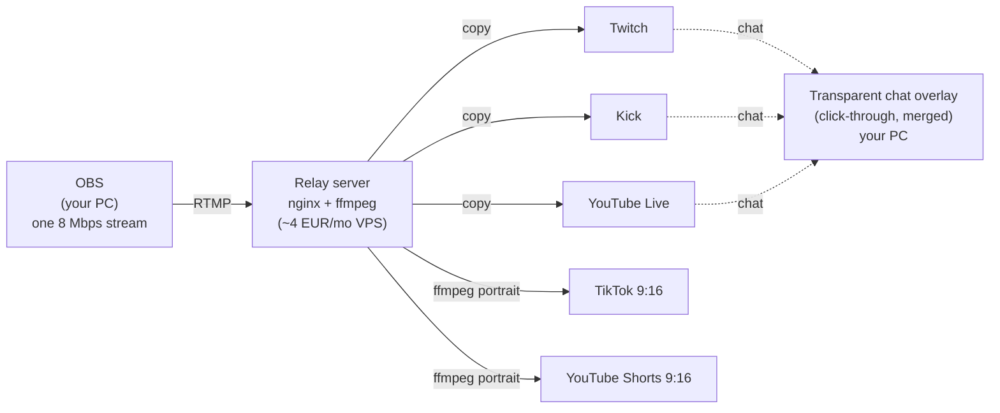

# KAT's Streaming Toolkit

**One stream in, every platform out - free.**

A set of tools that handle all the streaming stuff, because streams shouldn't cost rent.

OBS sends **one** stream to a cheap cloud relay; the relay fans it out to Twitch,
YouTube, Kick, TikTok - landscape copies *and* portrait (1080x1920) renditions with
center-crop or blurred-bars layout, generated automatically. On your PC, transparent
click-through chat overlays show merged (or per-platform) chat so you can play and
read at the same time.



## Components

| Piece | What it is | Where |
|---|---|---|
| **Toolkit app** | Windows desktop app (C#/WPF, .NET 8, x64): visual routing, Output Studio destination editor (reorder, encode tuning, OBS-style layer compositing for portrait outputs, true server-output preview), overlay manager, server-config generator, one-click SSH deploy with relay health status | `app/` |
| **Chat overlays** | Transparent always-on-top windows; merged or per-platform chat; Twitch (no login), Kick, YouTube connectors included; `Ctrl+Alt+C` locks/unlocks all | built into the app |
| **Relay** | nginx-rtmp + ffmpeg in Docker: single upstream in, per-platform pushes + portrait transcodes out | `server/` (or let the app export it) |
| **Setup guide** | Zero-to-live VPS walkthrough written for non-ops people | `server/VPS-SETUP.md` |

## Quick start

1. **Build the app** (one time, 64-bit):
   ```powershell
   dotnet build app\KatStreamToolkit.sln -c Release
   app\src\KatStreamToolkit\bin\Release\net8.0-windows\KatStreamToolkit.exe
   ```
2. In the app, fill in each destination's **ingest URL + stream key** (from the
   platform's dashboard) and toggle it on.
3. **Deploy**: either click **Deploy to server** on the Deploy tab (needs a VPS with
   Docker installed and your SSH user/password), or export the bundle and follow
   `SETUP.md` inside it (~15 minutes; `server/VPS-SETUP.md` has the long version).
4. OBS -> Settings -> Stream -> Custom -> `rtmp://YOUR.SERVER.IP/live` + your stream name.
5. Go live. Configure your chat overlays in the **Chat Overlays** tab.

## Secrets & portability

Stream keys and the server IP live in a **separate keys file** (`secrets.json` next to
your config by default) - `config.json` never contains them, so settings can be shared,
committed or exported without leaking anything. On the Relay tab, *Open...* points the
toolkit at an existing keys file and *Move to...* relocates it (USB stick / sync folder)
for portability. On screen, key and IP fields are masked with dots until clicked into,
and the nginx preview hides keys unless you tick *Show keys in preview* - so nothing
sensitive flashes while streaming. The exported server bundle still contains real keys
inside its `nginx.conf` (the relay cannot connect without them); that folder ships with
a `.gitignore` so it can't be committed.

## Why a relay?

Streaming to N platforms from home needs N copies of your bitrate going **up** -
most home connections can't. A relay swaps that for exactly one upstream; the server
(a 4 EUR box) does the multiplying. Bonus: your platform keys live on the server, not
in OBS, so rotating keys never touches your scenes.

## Status

- Working: relay generation + export, Twitch/Kick/YouTube chat overlays,
  portrait renditions (crop + blurred), traffic estimator, hotkey lock/unlock.
- On the roadmap: moderation + command runner, alert overlays, live status
  indicators - see `docs/ROADMAP.md`. TikTok chat is written but DELAYED
  until further notice (cannot be tested right now due to quirks in TikTok's
  streaming setup); TikTok video needs none of it and works today.

## Credits & license

Chat overlay design inspired by
[baffler/Transparent-Twitch-Chat-Overlay](https://github.com/baffler/Transparent-Twitch-Chat-Overlay).
MIT - see [LICENSE](LICENSE).
