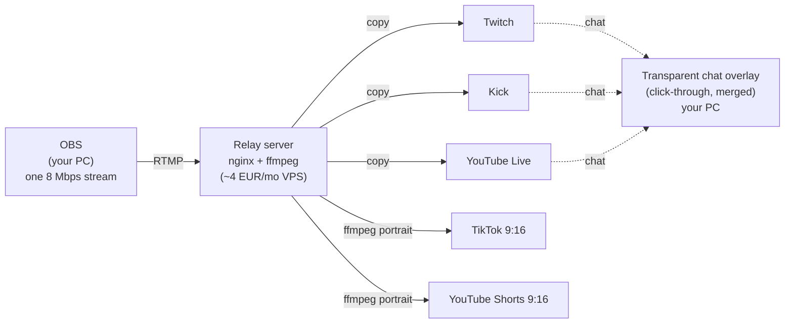

# KAT's Streaming Toolkit


**One stream in, every platform out - free.**

A set of tools that handle all the streaming stuff, because streams shouldn't cost rent.

OBS sends **one** stream to a cheap cloud relay; the relay fans it out to Twitch,
YouTube, Kick, TikTok - landscape copies *and* portrait (1080x1920) renditions with
center-crop or blurred-bars layout, generated automatically. On your PC, transparent
click-through chat overlays show merged (or per-platform) chat so you can play and
read at the same time.


```mermaid
flowchart LR
    OBS["OBS\n(your PC)\none 8 Mbps stream"] -->|RTMP| VPS["Relay server\nnginx + ffmpeg\n(~4 EUR/mo VPS)"]
    VPS -->|copy| TW["Twitch"]
    VPS -->|copy| YT["YouTube Live"]
    VPS -->|copy| KI["Kick"]
    VPS -->|ffmpeg portrait| TK["TikTok 9:16"]
    VPS -->|ffmpeg portrait| YS["YouTube Shorts 9:16"]
    TW -.chat.-> OV
    KI -.chat.-> OV
    YT -.chat.-> OV
    OV["Transparent chat overlay\n(click-through, merged)\nyour PC"]
```

## Components

| Piece | What it is | Where |
|---|---|---|
| **Toolkit app** | Windows desktop app (C#/WPF, .NET 8, x64): visual routing, Output Studio destination editor (reorder, encode tuning, OBS-style layer compositing for portrait outputs, live server-output preview), overlay manager, server-config generator, one-click SSH deploy with relay health status, watchdog with auto-restart, one-button go-live/end-stream | `app/` |
| **Chat overlays** | Transparent always-on-top windows; merged or per-platform chat; Twitch (anonymous or logged-in via OAuth), Kick and YouTube connectors; right-click moderation + `!commands` with a Twitch login; `Ctrl+Alt+C` locks/unlocks all (poll widget included) | built into the app |
| **Alerts & polls** | Follows/subs/raids as plain-text overlay lines (+ optional OBS scroll banner), automatic OBS scene switching per event, and a poll/prediction widget for your active Twitch poll | built into the app |
| **Relay** | nginx-rtmp + ffmpeg in Docker: single upstream in, per-platform pushes + portrait transcodes out | `server/` (or let the app export it) |
| **Setup guide** | Zero-to-live VPS walkthrough written for non-ops people | `server/VPS-SETUP.md` |

## Quick start

**You need**: a Windows 10/11 PC (x64) with OBS, a VPS with Docker (any
provider - the built-in server doctor checks the firewall/MTU pitfalls for
you), and your platforms' stream keys. Building from source needs the
[.NET 8 SDK](https://dotnet.microsoft.com/download/dotnet/8.0).

1. **Build the app** (one time, 64-bit):
   ```powershell
   dotnet build app\KatStreamToolkit.sln -c Release
   app\src\KatStreamToolkit\bin\Release\net8.0-windows\KatStreamToolkit.exe
   ```
2. In the app, fill in each destination's **ingest URL + stream key** (from the
   platform's dashboard) and toggle it on.
3. **Deploy**: either click **Deploy to server** on the Deploy tab (needs a VPS with
   Docker installed and your SSH user + password or key), or export the bundle and follow
   `SETUP.md` inside it (~15 minutes; `server/VPS-SETUP.md` has the long version).
4. OBS -> Settings -> Stream -> Custom -> `rtmp://YOUR.SERVER.IP/live` + your stream name.
5. Go live. Configure your chat overlays in the **Chat Overlays** tab. Optional: log in
   to Twitch on the *Channels & account* sub-tab to unlock chat replies, `!commands`,
   moderation, alerts and the poll widget.

## Secrets & portability

Stream keys and the server IP live in a **separate keys file** (`secrets.json` next to
your config by default) - `config.json` never contains them, so settings can be shared,
committed or exported without leaking anything. On the Relay tab, *Open...* points the
toolkit at an existing keys file and *Move to...* relocates it (USB stick / sync folder)
for portability. On screen, key and IP fields are masked with dots until clicked into,
and the nginx preview hides keys unless you tick *Show keys in preview* - so nothing
sensitive flashes while streaming. The exported server bundle still contains real keys
inside its `nginx.conf` (the relay cannot connect without them); that folder ships with
a `.gitignore` so it can't be committed.

## Why a relay?

Streaming to N platforms from home needs N copies of your bitrate going **up** -
most home connections can't. A relay swaps that for exactly one upstream; the server
(a 4 EUR box) does the multiplying. Bonus: your platform keys live on the server, not
in OBS, so rotating keys never touches your scenes.

## Why C#/WPF?

The toolkit is a **Windows desktop app on purpose**:

- **WPF covers exactly what the app needs natively** - chromeless always-on-top
  transparent overlays, global hotkeys (`Ctrl+Alt+C`/`X`), a themeable dark UI,
  and single-executable distribution (matching the planned portable build).
- **The whole stack already exists as C# libraries** - SSH.NET (deploy, monitor,
  live preview over SSH), HTTP/OAuth/JWT for the Twitch Helix, Kick and YouTube
  APIs, websockets for obs-websocket and Twitch EventSub. No bridge code needed.
- **Scope** - this stays a self-hosted single-user tool (see
  `docs/IDEAS.md`), so a cross-platform/web stack would add complexity for
  nothing; Windows + OBS on one PC is the supported setup (second-PC OBS is
  explicitly post-release).

The relay side is deliberately *not* C#: it's nginx-rtmp + ffmpeg in Docker,
because battle-tested streaming servers beat anything an app could embed.

## Status - v1.0.0

Everything below ships and is in daily use on a live stream.

**Relay & outputs**

- One-click SSH deploy of the nginx-rtmp + ffmpeg Docker bundle, with a
  streaming deploy log (build steps appear as they happen).
- **Output Studio**: visual destination editor - drag-to-reorder pipeline
  cards, encode tuning (preset/fps/bitrate/delay), OBS-style layer
  compositing for portrait outputs (input cuts, transparent PNGs, blur,
  backgrounds), and a live server-output preview of exactly what the
  platform receives.
- **Per-destination quality ladder**: extra downscaled rungs (e.g. 1080p
  main + 720p/480p) pushed beside the main output, watchdog-monitored.
- **Audio per destination**: loudness normalization (-16 LUFS) + volume
  trim, inherited by ladder rungs.
- **Go-live**: one-button Start/End stream via obs-websocket (verifies the
  relay, drives OBS, confirms arrival), plus Twitch title/category sync.
- **Watchdog**: 10s health pass with per-condition alarms built from the
  relay log, frozen-encoder auto-restart, per-alarm restart buttons,
  optional alarm sound.

**Chat, moderation & alerts**

- Transparent click-through chat overlays: merged or per-platform,
  Twitch/Kick/YouTube, per-overlay font + colors, `Ctrl+Alt+C` locks
  everything.
- **Moderation** (Twitch login): right-click a chat line for timeout/ban/
  delete, slow-mode toggle, and a shared word filter for every overlay.
- **`!commands` runner** with cooldowns, per-command overlay toggle and
  OBS scene actions.
- **Alerts**: follows/subs/raids as overlay lines, optional OBS scroll
  banner file, and automatic OBS scene switching per event (with hold +
  return).

**Status & ops**

- **Status board**: every destination's relay push state, platform live
  state and viewer count in one grid, plus a live server resource line.
- **Metrics**: 24h relay bandwidth chart + monthly bandwidth watchdog.
- **Server doctor**: one-click checklist (Docker, relay, disk, MTU/MSS,
  firewall, config freshness, outside-in 1935 probe) with provider
  detection and a ufw auto-fix button.
- **Encrypted backups**: scheduled .katbak backups of config + keys
  (PBKDF2 + AES-GCM), one-click restore.
- Key rotation reminders, relay health status, per-platform live checks.

**Not in v1.0.0 (on purpose)**: Kick/YouTube are read-only until their
OAuth logins land; the Twitch poll widget needs an affiliate/partner
channel; the TikTok *chat* connector is delayed (TikTok video works
today); second-PC OBS is post-release. See
[`docs/ROADMAP.md`](docs/ROADMAP.md).

## Project docs

- [`docs/ROADMAP.md`](docs/ROADMAP.md) - the actionable queue (shipped, next, later).
- [`docs/IDEAS.md`](docs/IDEAS.md) - idea write-ups with Kats' ratings.
- [`docs/BUGS.md`](docs/BUGS.md) - the bug ledger: every finding from the full
  code scans and live-debug sessions, with cause and fix (all passes fixed).
- [`docs/PROGRESS.md`](docs/PROGRESS.md) - session handoff notes.

## Credits & license

Chat overlay design inspired by
[baffler/Transparent-Twitch-Chat-Overlay](https://github.com/baffler/Transparent-Twitch-Chat-Overlay).
MIT - see [LICENSE](LICENSE).
